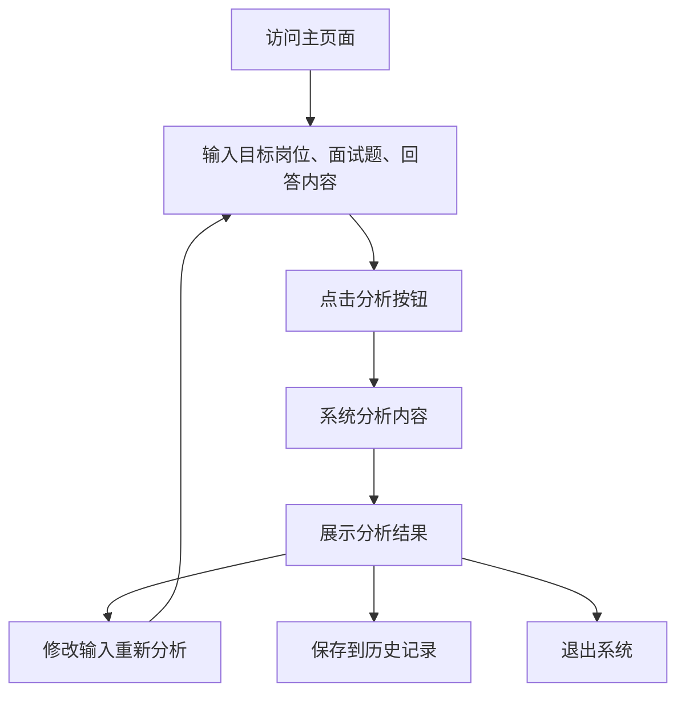

# 面试分析工具产品需求文档

## 1. 产品概览

面试分析工具是一款面向求职者的智能面试辅助产品，通过分析用户的面试回答内容和简历，提供针对性的反馈和改进建议，帮助用户提升面试表现和简历质量。

产品的核心价值在于：
- 提供即时、专业的面试回答分析
- 帮助用户发现并改进面试中的问题
- 预测面试官可能的后续追问，提前做好准备
- 根据职位描述自动优化简历内容
- 提升用户的面试竞争力和自信心

## 2. 核心功能

### 2.1 用户角色

本产品为单一角色产品，所有用户均可直接使用核心功能，无需复杂的角色区分。

### 2.2 功能模块

我们的面试分析工具包含以下核心功能模块：

1. **基础输入模块**：
   - 目标岗位输入
   - 面试题输入
   - 回答内容输入

2. **核心分析模块**：
   - 回答偏离度分析
   - 逻辑结构分析
   - 案例具体性分析
   - 表达质量分析

3. **结果输出模块**：
   - 核心问题识别
   - 改进建议生成
   - 预测追问生成

### 2.3 页面详情

| 页面名称 | 模块名称 | 功能描述 |
|---------|---------|--------|
| 主页面 | 输入区域 | 提供目标岗位、面试题和回答内容的输入字段，支持文本输入和粘贴 |
| 主页面 | 分析按钮 | 点击后触发分析流程，显示加载状态 |
| 主页面 | 分析结果区域 | 展示分析结果，包括核心问题、改进建议和预测追问 |
| 主页面 | 重新分析按钮 | 允许用户修改输入后重新分析 |
| 主页面 | 历史记录 | 保存用户的分析历史，方便查看和对比 |

## 3. Core Process

### 用户操作流程

1. 用户访问产品主页面
2. 在输入区域填写目标岗位、面试题和自己的回答内容
3. 点击「分析回答」按钮
4. 系统处理并分析输入内容
5. 系统展示分析结果，包括：
   - 核心问题：指出回答中存在的主要问题
   - 改进建议：提供具体的修改方向和建议
   - 预测追问：列出面试官可能会继续追问的问题
6. 用户查看分析结果，可选择：
   - 修改输入内容重新分析
   - 保存分析结果到历史记录
   - 退出系统



## 4. 目标用户

### 4.1 主要用户群体

1. **求职者**：
   - 正在寻找新工作机会的职场人士
   - 需要准备面试的应届毕业生
   - 希望提升面试技巧的求职者

2. **学生**：
   - 即将毕业需要准备校招面试的学生
   - 希望提前了解面试流程和技巧的在校学生

3. **职场人士**：
   - 准备晋升面试的员工
   - 希望跳槽到更好公司的职场人

4. **培训机构**：
   - 职业培训机构的讲师
   - 就业指导中心的顾问

### 4.2 用户需求

1. **面试准备**：
   - 希望了解自己的面试回答质量
   - 需要针对特定岗位的面试准备
   - 希望获得专业的反馈和建议

2. **自我评估**：
   - 希望客观评估自己的面试表现
   - 发现自己在面试中的不足之处
   - 了解自己与理想回答的差距

3. **提升需求**：
   - 希望通过练习提升面试技巧
   - 需要具体的改进方向和方法
   - 希望模拟真实面试场景

4. **预测需求**：
   - 希望了解面试官可能的后续问题
   - 提前准备应对各种问题的策略
   - 减少面试中的意外情况

## 5. 产品目标

### 5.1 核心目标

1. **提升面试准备效率**：
   - 快速分析用户回答，提供即时反馈
   - 减少用户在面试准备上的时间投入
   - 提供有针对性的改进建议

2. **提供个性化反馈**：
   - 根据不同岗位的要求分析回答
   - 针对用户的具体回答提供个性化建议
   - 考虑用户的背景和经验水平

3. **增强面试竞争力**：
   - 帮助用户发现并改进面试中的问题
   - 提供高质量的回答参考
   - 预测可能的追问，提前做好准备

4. **提升用户自信心**：
   - 通过专业分析增强用户的面试信心
   - 帮助用户形成结构化的回答思路
   - 提供正面的鼓励和支持

### 5.2 产品价值

1. **即时反馈**：用户无需等待他人评价，即可获得专业的分析结果
2. **智能分析**：利用AI技术深度分析回答内容，提供全面的评估
3. **模拟追问**：预测面试官可能的后续问题，帮助用户提前准备
4. **持续改进**：通过历史记录跟踪用户的进步，提供持续的改进建议
5. **便捷使用**：简单的界面设计，无需专业知识即可使用

## 6. Demo阶段核心功能

### 6.1 优先实现功能

1. **基础输入功能**：
   - 目标岗位输入（文本框）
   - 面试题输入（文本框）
   - 回答内容输入（多行文本框）

2. **核心分析功能**：
   - 回答偏离度分析（是否答偏）
   - 逻辑结构分析（逻辑是否清楚）
   - 案例具体性分析（案例是否具体）
   - 表达质量分析（是否像真实面试中的高质量回答）

3. **结果输出功能**：
   - 核心问题识别（列出主要问题）
   - 改进建议生成（提供具体修改方向）
   - 预测追问生成（列出可能的后续问题）

### 6.2 功能优先级

1. **必须实现**：
   - 基础输入功能
   - 核心分析功能
   - 结果输出功能

2. **后续考虑**：
   - 历史记录功能
   - 用户账户系统
   - 多语言支持
   - 语音输入功能
   - 视频面试分析

## 7. 技术架构

### 7.1 技术栈选择

- **前端**：
  - HTML5 + CSS3 + JavaScript
  - 响应式设计，支持PC和移动设备
  - 现代前端框架（如React、Vue等）

- **后端**：
  - 服务器端语言（如Python、Node.js等）
  - 机器学习/自然语言处理库（如NLTK、spaCy、TensorFlow等）
  - API接口设计

- **数据库**：
  - 轻量级数据库（如SQLite、MongoDB等）
  - 用于存储用户历史记录和分析结果

### 7.2 核心算法

1. **文本分析算法**：
   - 关键词提取和分析
   - 语义理解和匹配
   - 逻辑结构分析

2. **评分算法**：
   - 多维度评分系统
   - 权重分配和计算
   - 结果标准化处理

3. **预测算法**：
   - 基于面试题和回答内容的关联分析
   - 常见面试问题模式识别
   - 智能推荐可能的追问

## 8. 数据结构设计

### 8.1 输入数据结构

```json
{
  "target_position": "产品经理",
  "interview_question": "请描述一个你成功解决的产品问题",
  "user_answer": "我在之前的公司负责一个电商平台的用户体验优化。我们发现用户在结账流程中流失率很高，于是我带领团队分析了用户行为数据，发现主要问题是结账步骤过多。我们简化了结账流程，减少了不必要的步骤，最终提高了转化率。"
}
```

### 8.2 分析结果数据结构

```json
{
  "analysis_result": {
    "core_issues": [
      "案例描述不够具体，缺乏具体的数据和细节",
      "逻辑结构不够清晰，没有明确的问题-解决方案-结果结构"
    ],
    "improvement_suggestions": [
      "增加具体的数据，如转化率提升了多少百分比",
      "采用STAR法则（情境-任务-行动-结果）结构化回答",
      "详细描述你在解决问题过程中的具体行动和决策"
    ],
    "predicted_questions": [
      "你是如何分析用户行为数据的？",
      "在简化结账流程时遇到了哪些挑战？如何解决的？",
      "除了简化步骤，你还采取了哪些措施来提高转化率？"
    ]
  }
}
```

## 9. 产品验收标准

### 9.1 功能完整性

- [ ] 所有核心功能模块能够正常运行
- [ ] 输入字段能够正确接收和处理用户输入
- [ ] 分析按钮能够触发分析流程
- [ ] 分析结果能够完整展示所有三个部分
- [ ] 重新分析功能能够正常工作

### 9.2 分析准确性

- [ ] 能够正确识别回答是否偏离主题
- [ ] 能够准确分析回答的逻辑结构
- [ ] 能够评估案例的具体性和详细程度
- [ ] 能够判断回答是否符合高质量面试回答的标准
- [ ] 能够生成合理的改进建议
- [ ] 能够预测可能的后续追问

### 9.3 响应速度

- [ ] 分析过程响应时间不超过3秒
- [ ] 页面加载时间不超过2秒
- [ ] 操作反馈及时，无明显延迟

### 9.4 用户体验

- [ ] 界面设计简洁明了，易于使用
- [ ] 输入字段有适当的提示和验证
- [ ] 分析结果展示清晰，层次分明
- [ ] 错误提示友好，易于理解
- [ ] 整体操作流程顺畅，无卡顿

### 9.5 兼容性

- [ ] 支持主流浏览器（Chrome、Firefox、Safari、Edge）
- [ ] 响应式设计，适配不同屏幕尺寸
- [ ] 移动端访问体验良好

## 10. 总结

面试分析工具是一款旨在帮助用户提升面试表现和简历质量的智能辅助产品。通过分析用户的面试回答和简历，提供针对性的反馈和改进建议，预测可能的后续追问，以及根据职位描述自动优化简历内容，帮助用户在求职过程中取得更好的表现。

产品的核心价值在于：
- 提供即时、专业的面试分析
- 帮助用户发现并改进面试中的问题
- 预测面试官可能的后续追问，提前做好准备
- 根据职位描述自动优化简历内容，提高匹配度
- 提升用户的面试竞争力和自信心

Demo阶段将优先实现面试分析和简历修改的核心功能，确保产品的核心价值能够得到充分展示。具体包括：
- 面试分析的基础输入、核心分析和结果输出功能
- 简历修改的基础输入、核心分析和结果输出功能

随着产品的发展，我们将逐步添加更多功能，如历史记录、用户账户系统、多语言支持等，进一步提升产品的使用体验和价值。